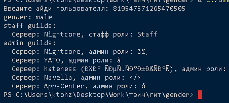
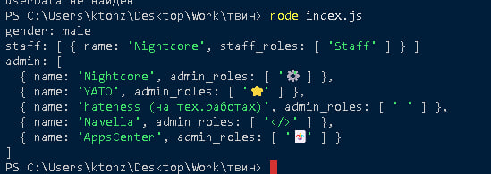

# gender

Скрипт для определения гендера, стафф и админ ролей пользователя Discord через сервис [discord-sensor.com](https://discord-sensor.com).

## Возможности

- Получение гендера пользователя по его Discord ID
- Получение списка серверов, где у пользователя есть стафф или админ роли
- Примеры использования на Python и JavaScript

## Примеры

### Python



Пример запуска:  
```bash
python example.py
```

### JavaScript (Node.js)



Пример запуска:  
```bash
node example.js
```

## Установка зависимостей

- Для Python: `pip install requests`
- Для Node.js: `npm install node-fetch`
